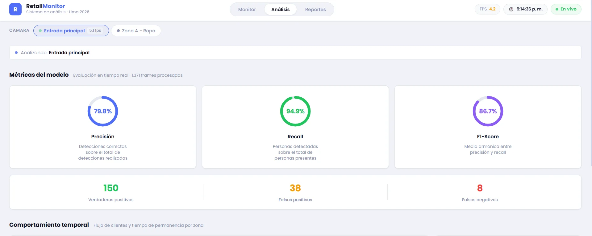
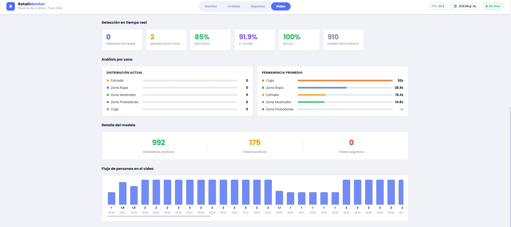
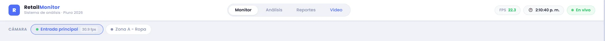

# RetailVision Analytics

Sistema de monitoreo de clientes en tiempo real usando YOLOv8 y visión artificial. Detecta y rastrea personas por zonas del local desde una o varias cámaras.

**Universidad César Vallejo · Piura 2026**

---

## Capturas

### 🖥️ Monitor — Feed en vivo + KPIs

Feed de cámara con bounding boxes, KPIs en tiempo real, distribución por zonas y mapa de calor acumulado.


### 📊 Análisis — Métricas del modelo

Precisión, Recall y F1-Score con anillos animados, conteo TP/FP/FN, historial de flujo por hora y permanencia promedio por zona.



### 📄 Reportes — Tabla por zona

Distribución de clientes por zona, porcentaje de participación, permanencia promedio y nivel de prioridad.


### 📄 Reportes — Recomendaciones automáticas

Sugerencias generadas por el sistema a partir del comportamiento detectado durante la sesión.


### 📹 Video — Análisis de archivo

Vista Video con el video procesado + métricas debajo



### 📷 Monitor — Selector multi-cámara

Vista Monitor con el selector de cámara visible (cuando tengas las dos activas)



---

## Requisitos

- Python 3.10+
- Node.js 18+
- Cámara web o cámara IP con RTSP

---

## Instalación

### 1. Clonar

```bash
git clone https://github.com/lcrisantosi7-cris/retailvision-analytics
cd retailvision-analytics
```

### 2. Entorno virtual

```bash
python -m venv venv

# Windows
venv\Scripts\activate

# macOS / Linux
source venv/bin/activate
```

> Windows — si PowerShell bloquea la activación:
>
> ```powershell
> Set-ExecutionPolicy -Scope CurrentUser -ExecutionPolicy RemoteSigned
> ```

### 3. Dependencias Python

**Si tienes GPU NVIDIA — hacer esto PRIMERO (mucho más rápido):**

```bash
pip install torch torchvision --index-url https://download.pytorch.org/whl/cu121
```

**Luego (o directamente si no tienes GPU):**

```bash
pip install -r requirements.txt
```

> Linux sin entorno gráfico:
>
> ```bash
> sudo apt-get install libgl1-mesa-glx libglib2.0-0
> pip install -r requirements.txt
> ```

### 4. Dependencias frontend

```bash
cd frontend
npm install
cd ..
```

---

## Configuración de cámaras

Edita el diccionario `CAMERAS` en `main.py`:

```python
# Webcam local
"cam_01": {
    "source": 0,          # 0 = primera cámara, 1 = segunda...
    "nombre": "Entrada",
    "zonas": { ... },
},

# Cámara IP (RTSP)
"cam_02": {
    "source": f"rtsp://admin:{os.getenv('CAM_02_PASS', '')}@192.168.0.x:554/H264?ch=1&subtype=0",
    "nombre": "Zona A",
    "zonas": { ... },
},
```

Las contraseñas van en `.env` (ya está en `.gitignore`):

```
CAM_02_PASS=XXXXXX
```

**Cámaras EZVIZ:** habilitar RTSP primero en la app → Cámara → ⚙ → Configuración del servidor local → activar RTSP.

---

## Ejecución

**Backend** (con el entorno virtual activado):

```bash
uvicorn main:app --host 0.0.0.0 --port 8000 --reload
```

**Frontend** (segunda terminal):

```bash
cd frontend
npm run dev
```

Abrir: **http://localhost:5173**

> La primera vez, YOLOv8 descarga automáticamente `yolov8n.pt` (~6 MB). Necesitas internet.

---

## Vistas

| Vista        | Descripción                                                      |
| ------------ | ---------------------------------------------------------------- |
| **Monitor**  | Feed en vivo, KPIs, zonas, heatmap y lista de clientes           |
| **Análisis** | Precisión, Recall, F1, historial por hora y permanencia por zona |
| **Reportes** | Reporte ejecutivo exportable a PDF                               |
| **📹 Video** | Sube un video MP4/AVI/MOV y analízalo con YOLOv8                 |

---

## API

| Ruta                             | Descripción                   |
| -------------------------------- | ----------------------------- |
| `GET /api/cameras`               | Lista de cámaras y su estado  |
| `GET /video/{cam_id}`            | Stream MJPEG                  |
| `WS /ws/monitor/{cam_id}`        | Datos en tiempo real          |
| `GET /api/metricas/{cam_id}`     | Precisión, Recall, F1         |
| `GET /api/historial/{cam_id}`    | Promedio de clientes por hora |
| `POST /api/upload-video`         | Subir video para análisis     |
| `GET /api/video-status/{job_id}` | Estado del procesamiento      |

Documentación interactiva: **http://localhost:8000/docs**

---

## Solución de problemas

**Cámara no abre** — cambia `"source": 0` a `1` o `2`. Si otra app usa la cámara (Zoom, Teams), ciérrala primero.

**Cámara IP no conecta** — verifica la URL en VLC antes de usar el backend: `Medio → Abrir ubicación de red`.

**Video lento** — instala PyTorch con CUDA si tienes GPU NVIDIA (ver paso 3). Sin GPU es normal ver menos FPS en CPU.

**`opencv-python` falla en Linux** — instala `libgl1-mesa-glx libglib2.0-0` antes.

**"Desconectado" en el frontend** — verifica que el backend esté corriendo en el puerto 8000.

---

## Stack

**Backend:** FastAPI · YOLOv8 (Ultralytics) · OpenCV · Uvicorn · python-dotenv

**Frontend:** React 19 · Vite · Recharts · jsPDF · html2canvas

---

_`venv/`, `node_modules/` y `.env` están en `.gitignore` — cada colaborador ejecuta la instalación localmente._

---

_RetailVision Analytics · Universidad César Vallejo · Piura 2026_
