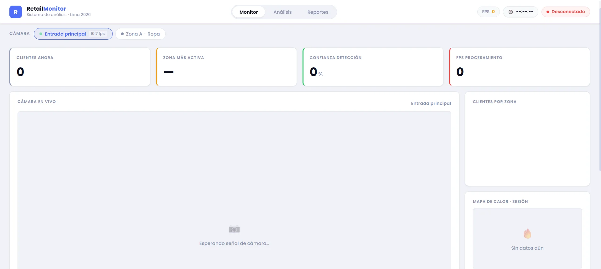
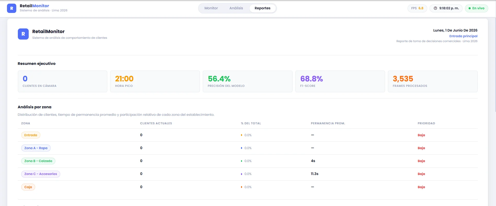
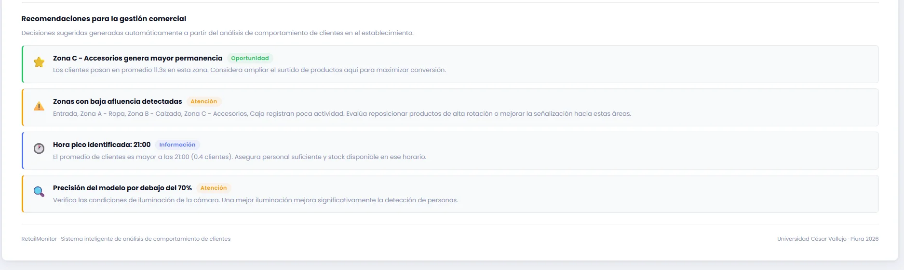

# RetailVision Analytics

> Sistema inteligente de monitoreo y análisis de comportamiento de clientes en establecimientos comerciales, desarrollado con visión artificial (YOLOv8) y una interfaz web en tiempo real.

**Proyecto de investigación aplicada — Universidad César Vallejo · Piura 2026**

---

## ¿Qué hace el sistema?

RetailVision Analytics conecta una o varias cámaras al local comercial y, usando el modelo de detección YOLOv8, detecta y rastrea automáticamente a cada persona que entra al establecimiento. Toda la información se visualiza en tiempo real desde cualquier navegador web.

El sistema soporta **múltiples cámaras simultáneas** (webcam local, cámaras IP por RTSP, etc.), cada una con sus propias zonas, métricas e historial independientes.

---

## Vistas del sistema

### 🖥️ Vista Monitor

La pantalla principal. Muestra:

- **Selector de cámara** — cambia entre cámaras activas en tiempo real.
- **Feed de cámara en vivo** con bounding boxes sobre cada persona detectada, identificadas por ID y zona.
- **4 KPIs en tiempo real**: clientes en cámara, zona más activa, confianza promedio de detección y FPS de procesamiento.
- **Gráfico de barras por zona**: cuántos clientes hay en cada área del local en este momento.
- **Mapa de calor acumulado**: visualización de las zonas con mayor concentración de movimiento durante la sesión.
- **Tabla de clientes activos**: lista de cada persona detectada con su ID, zona actual, confianza y tiempo de permanencia.

### 📊 Vista Análisis

Métricas técnicas del modelo y estadísticas de comportamiento **por cámara seleccionada**:

- **Precisión, Recall y F1-Score** del modelo YOLOv8, calculados en tiempo real con anillos circulares animados.
- **Conteo de TP / FP / FN** (verdaderos positivos, falsos positivos, falsos negativos).
- **Gráfico de línea** con el promedio de clientes por hora a lo largo del día.
- **Gráfico de barras horizontales** con el tiempo promedio de permanencia por zona.

### 📄 Vista Reportes

Reporte ejecutivo descargable en PDF **por cámara seleccionada**:

- **Resumen ejecutivo** con los KPIs más importantes de la sesión.
- **Tabla de análisis por zona** con clientes, porcentaje del total, permanencia promedio y nivel de prioridad.
- **Historial de flujo por hora** en formato de barras.
- **Recomendaciones automáticas** generadas por el sistema a partir de los datos.
- Botón **"Descargar PDF"** que exporta todo el reporte con fecha, cámara y membrete institucional.

---

## Arquitectura

```
┌──────────────────────────────────────────────────────────────┐
│                      BACKEND (Python)                        │
│                                                              │
│  Por cada cámara:                                            │
│    Hilo CAPTURA   → solo lee frames (sin bloqueos)           │
│    Hilo INFERENCIA → YOLOv8 sobre el frame más reciente      │
│                                                              │
│  MJPEG stream  /video/{cam_id}        → Video fluido         │
│  WebSocket     /ws/monitor/{cam_id}   → Datos JSON (0.5 s)   │
│  REST API      /api/{recurso}/{cam_id}→ Historial, métricas  │
│  REST API      /api/cameras           → Lista de cámaras     │
└──────────────────────────────────────────────────────────────┘
                          ↕ HTTP / WS
┌──────────────────────────────────────────────────────────────┐
│                   FRONTEND (React + Vite)                    │
│                                                              │
│  CameraSelector → selecciona la cámara activa                │
│  Monitor   →  + WebSocket             │
│  Análisis  → fetch /api/metricas/{id} + /api/historial/{id}  │
│  Reportes  → fetch APIs + jsPDF + html2canvas                │
└──────────────────────────────────────────────────────────────┘
```

---

## Requisitos previos

| Requisito             | Versión mínima                            |
| --------------------- | ----------------------------------------- |
| Python                | 3.10                                      |
| Node.js (incluye npm) | 18                                        |
| Git                   | cualquiera                                |
| Cámara                | webcam USB/integrada o cámara IP con RTSP |

> **GPU opcional:** si tu equipo tiene una GPU NVIDIA con CUDA, el sistema la detecta y la usa automáticamente para acelerar la inferencia. Sin GPU, corre perfectamente en CPU (más lento).

---

## Instalación paso a paso

### 1. Clonar el repositorio

```bash
git clone https://github.com/lcrisantosi7-cris/retailvision-analytics.git
cd retailvision-analytics
```

### 2. Crear y activar el entorno virtual de Python

```bash
python -m venv venv
```

```bash
# Windows
venv\Scripts\activate

# macOS / Linux
source venv/bin/activate
```

> **Windows — error de permisos:** si PowerShell bloquea la activación, ejecuta esto como administrador una sola vez:
>
> ```powershell
> Set-ExecutionPolicy -Scope CurrentUser -ExecutionPolicy RemoteSigned
> ```

### 3. Instalar dependencias de Python

```bash
pip install -r requirements.txt
```

> La primera vez que arranque el backend, YOLOv8 descargará automáticamente `yolov8n.pt` (~6 MB). Necesitas internet en ese momento.

**Con GPU NVIDIA (opcional, mucho más rápido):**

```bash
# Instalar PyTorch con CUDA 12.x ANTES de instalar requirements.txt
pip install torch torchvision --index-url https://download.pytorch.org/whl/cu121
pip install -r requirements.txt
```

**Linux sin entorno gráfico (servidor / WSL):**

```bash
sudo apt-get install libgl1-mesa-glx libglib2.0-0
pip install -r requirements.txt
```

### 4. Instalar dependencias del frontend

```bash
cd frontend
npm install
cd ..
```

### 5. Configurar las cámaras

Abre `main.py` y edita el diccionario `CAMERAS`:

**Webcam local:**

```python
"cam_01": {
    "source": 0,          # 0 = primera cámara, 1 = segunda, etc.
    "nombre": "Entrada principal",
    "zonas": { ... },
},
```

**Cámara IP (RTSP) — ej. EZVIZ:**

```python
"cam_02": {
    "source": f"rtsp://admin:{os.getenv('CAM_02_PASS', '')}@192.168.0.106:554/H264?ch=1&subtype=0",
    "nombre": "Zona A - Ropa",
    "zonas": { ... },
},
```

Para cámaras IP, crea un archivo `.env` en la raíz del proyecto con las contraseñas:

```
CAM_02_PASS=XXXXXX
CAM_03_PASS=XXXXXX
```

> El archivo `.env` está en `.gitignore` y nunca se sube al repositorio.

**Cámaras EZVIZ — requisito previo:**
Habilitar RTSP en la app antes de conectar:
`App EZVIZ → Cámara → ⚙ Ajustes → Configuración del servidor local → activar RTSP`

### 6. Ejecutar el backend

Con el entorno virtual activado, desde la raíz del proyecto:

```bash
uvicorn main:app --host 0.0.0.0 --port 8000 --reload
```

Salida esperada:

```
[CAP cam_01] Conectando a: 0
[CAP cam_01] Conectado correctamente.
[INF cam_01] YOLO en dispositivo: cpu
[OK] Hilos iniciados para cam_01 (Entrada principal)
INFO:     Uvicorn running on http://0.0.0.0:8000
```

### 7. Ejecutar el frontend

Abre una **segunda terminal**:

```bash
cd frontend
npm run dev
```

```
  VITE ready in Xms
  ➜  Local:   http://localhost:5173/
```

### 8. Abrir la aplicación

```
http://localhost:5173
```

El indicador **"En vivo"** en el header confirma que el frontend está conectado al backend.

---

## Endpoints del backend

| Método | Ruta                      | Descripción                                 |
| ------ | ------------------------- | ------------------------------------------- |
| `GET`  | `/`                       | Estado de la API y lista de cámaras         |
| `GET`  | `/api/cameras`            | Lista de cámaras con estado, FPS y clientes |
| `GET`  | `/video/{cam_id}`         | Stream MJPEG de la cámara                   |
| `WS`   | `/ws/monitor/{cam_id}`    | WebSocket con datos JSON en tiempo real     |
| `GET`  | `/api/snapshot/{cam_id}`  | Estado actual sin imágenes                  |
| `GET`  | `/api/historial/{cam_id}` | Promedio de clientes por hora               |
| `GET`  | `/api/metricas/{cam_id}`  | Precisión, Recall, F1 y tiempos por zona    |
| `GET`  | `/api/zonas/{cam_id}`     | Lista de zonas configuradas                 |

> Los endpoints sin `/{cam_id}` (ej. `/video`, `/api/metricas`) siguen funcionando y apuntan a la primera cámara configurada — compatibilidad con versiones anteriores.

> Con el backend corriendo, ve a `http://localhost:8000/docs` para ver la documentación interactiva (Swagger UI).

---

## Estructura del proyecto

```
retailvision-analytics/
├── main.py                  # Backend: FastAPI + YOLOv8 + OpenCV
├── requirements.txt         # Dependencias de Python
├── .env                     # Credenciales de cámaras IP (NO se sube a git)
├── yolov8n.pt               # Modelo YOLOv8 nano (se descarga automáticamente)
├── venv/                    # Entorno virtual (no se sube a git)
│
└── frontend/
    ├── index.html
    ├── package.json
    ├── vite.config.js
    └── src/
        ├── App.jsx              # Raíz de la app, navegación y selector de cámara
        ├── index.css            # Variables globales, tipografía Poppins
        ├── hooks/
        │   ├── useMonitor.js    # WebSocket por cámara con reconexión automática
        │   ├── useAnalisis.js   # Fetch de métricas e historial por cámara
        │   └── useReporte.js    # Fetch combinado para reportes por cámara
        ├── components/
        │   ├── Header.jsx            # Navegación + estado de conexión + FPS
        │   ├── CameraSelector.jsx    # Selector de cámara activa
        │   ├── StatCard.jsx          # Tarjeta de KPI con borde de color
        │   ├── CameraFeed.jsx        # Visor MJPEG en vivo por cámara
        │   ├── ZoneChart.jsx         # Gráfico de barras por zona (Recharts)
        │   ├── Heatmap.jsx           # Mapa de calor acumulado
        │   ├── ClientList.jsx        # Tabla de clientes activos
        │   ├── AnalisisView.jsx      # Vista completa de análisis por cámara
        │   ├── MetricaBadge.jsx      # Anillo circular SVG para métricas
        │   ├── HistorialChart.jsx    # Gráfico de línea por hora
        │   ├── TiempoZonaChart.jsx   # Barras horizontales de permanencia
        │   └── ReporteView.jsx       # Vista de reportes con exportación PDF
        └── utils/
            └── generarReporte.js     # Lógica de recomendaciones + exportación PDF
```

---

## Configurar zonas del local

Las zonas se definen en `main.py` como coordenadas normalizadas (0.0 a 1.0) sobre el frame de la cámara. Cada cámara tiene sus propias zonas independientes.

```python
"zonas": {
    #          nombre              x1    y1    x2    y2
    "Entrada":             (0.00, 0.00, 0.20, 1.00),  # 0%–20% del ancho
    "Zona A - Ropa":       (0.20, 0.00, 0.45, 0.50),  # 20%–45%, mitad superior
    "Zona B - Calzado":    (0.20, 0.50, 0.45, 1.00),  # 20%–45%, mitad inferior
    "Zona C - Accesorios": (0.45, 0.00, 0.75, 1.00),  # 45%–75%
    "Caja":                (0.75, 0.00, 1.00, 1.00),  # 75%–100%
},
```

Las coordenadas son fracciones del ancho/alto del frame, por lo que no dependen de la resolución de la cámara.

---

## Solución de problemas

**La cámara no abre**

Cambia `"source": 0` a `1` o `2` en `main.py` y reinicia el backend. Si otra aplicación usa la cámara (Teams, Zoom, OBS), ciérrala primero.

---

**La cámara IP no conecta**

1. Verifica que RTSP esté habilitado en la app de la cámara.
2. Prueba la URL en VLC: `Medio → Abrir ubicación de red` y pega la URL RTSP.
3. Si VLC conecta pero el backend no, revisa que el `.env` tenga la contraseña correcta.
4. Prueba los paths alternativos comentados en `main.py` (`subtype=1`, `/h264_stream`, etc.).

---

**El video se ve lento o con lag**

El sistema ya separa los hilos de captura e inferencia para maximizar la fluidez. Si sigue lento:

1. Confirma que usas `yolov8n.pt` (nano) — ya está configurado por defecto.
2. Instala PyTorch con CUDA si tienes GPU NVIDIA (ver paso 3 de instalación).
3. En redes lentas, el lag del stream MJPEG es normal — los datos del WebSocket (métricas, zonas) siempre llegan a tiempo independientemente del video.

---

**El video no aparece en el navegador**

Abre `http://localhost:8000/video/cam_01` directamente en el navegador para verificar que el stream MJPEG funciona.

---

**El indicador dice "Desconectado"**

El frontend no puede conectarse al WebSocket. Verifica que el backend esté activo en el puerto 8000 y que no haya un firewall bloqueando la conexión.

---

**Error al instalar `opencv-python` en Linux**

```bash
sudo apt-get install libgl1-mesa-glx libglib2.0-0
pip install -r requirements.txt
```

---

## Tecnologías utilizadas

**Backend**

- [FastAPI](https://fastapi.tiangolo.com/) — API REST y WebSocket
- [Ultralytics YOLOv8](https://docs.ultralytics.com/) — detección y tracking de personas
- [OpenCV](https://opencv.org/) — captura de cámara, procesamiento de imagen y heatmap
- [Uvicorn](https://www.uvicorn.org/) — servidor ASGI
- [python-dotenv](https://pypi.org/project/python-dotenv/) — gestión de variables de entorno

**Frontend**

- [React 19](https://react.dev/) + [Vite](https://vitejs.dev/)
- [Recharts](https://recharts.org/) — gráficos de barras y líneas
- [jsPDF](https://github.com/parallax/jsPDF) + [html2canvas](https://html2canvas.hertzen.com/) — exportación a PDF
- CSS Modules + tipografía [Poppins](https://fonts.google.com/specimen/Poppins)

---

## Capturas de pantalla

### 🖥️ Dashboard — Vista Monitor

Panel principal con feed de cámara en vivo, KPIs en tiempo real, gráfico de distribución por zonas y mapa de calor acumulado de la sesión.

> 

### 📊 Analytics — Vista Análisis

Métricas de rendimiento del modelo YOLOv8 (Precisión, Recall y F1-Score) con anillos animados, conteo de TP/FP/FN, historial de flujo por hora y permanencia promedio por zona.

> 

### 📄 Reportes — Vista Reportes

**Tabla de análisis por zona** con clientes, porcentaje de participación, permanencia promedio y nivel de prioridad.

> 

**Recomendaciones automáticas** generadas por el sistema a partir del comportamiento detectado durante la sesión.

> 

---

## Notas para producción

- `venv/` y `node_modules/` están en `.gitignore` — cada colaborador ejecuta los pasos de instalación en su propia máquina.
- `.env` está en `.gitignore` — las contraseñas de cámaras IP nunca se suben al repositorio. Cada colaborador crea su propio `.env` local.
- Para acceder desde otra computadora en la misma red, reemplaza `localhost` por la IP del servidor en `src/hooks/useMonitor.js`, `useAnalisis.js`, `useReporte.js` y `src/components/CameraFeed.jsx`.
- Para despliegue sin internet, descarga `yolov8n.pt` manualmente desde [github.com/ultralytics/assets](https://github.com/ultralytics/assets/releases) y colócalo en la raíz del proyecto.

---

_RetailVision Analytics · Universidad César Vallejo · Lima 2026_
